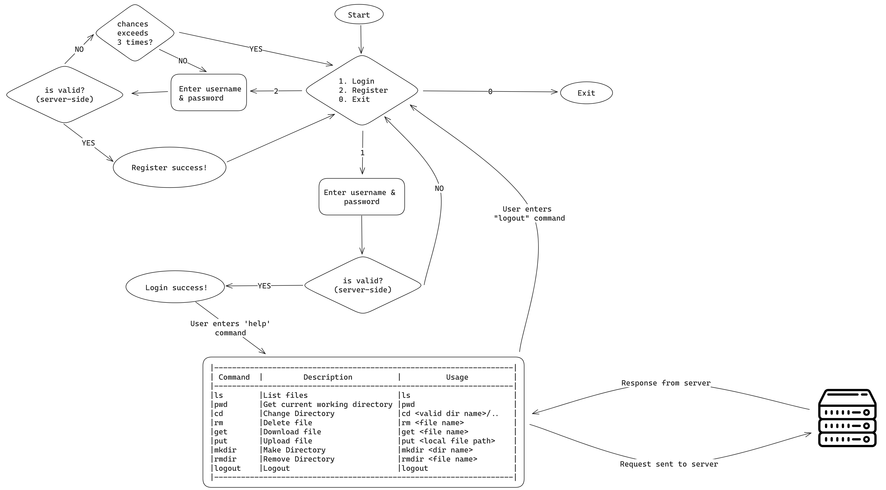

# Remote File System
created by: https://github.com/thatbackendguy/

## Flow Diagram


## Steps to run
1. Run server
```bash
java BootStrap server
```
2. Run client
```bash
java BootStrap client
```
> Note: If running the server and client on different machines, add the `config.json` file where the program is being executed.
> ```json
> {
>   "HOST": "<IP of server>",
>   "PORT": <port>
> }
> ```
